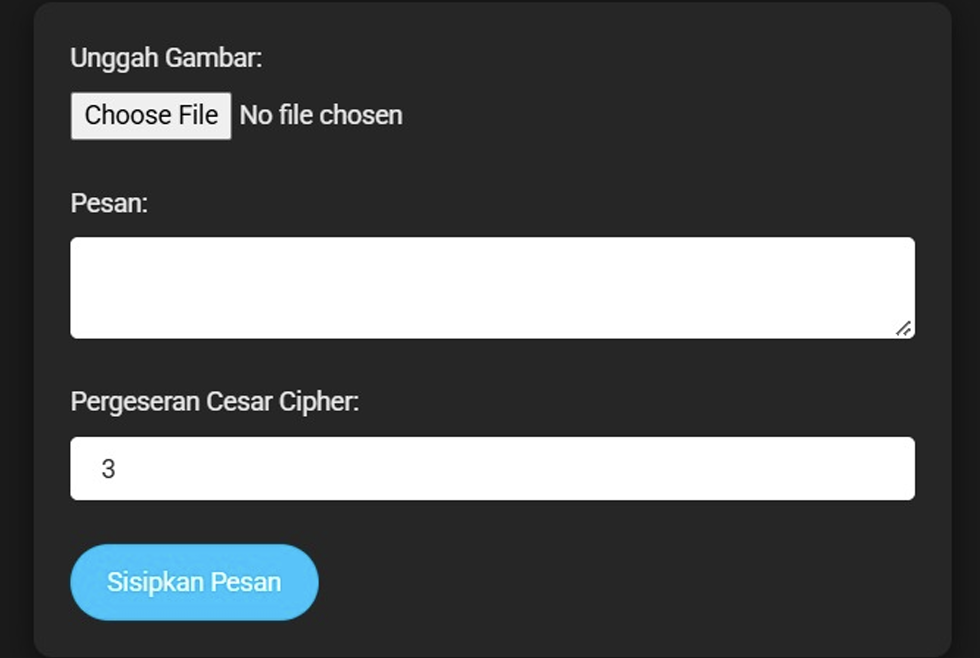
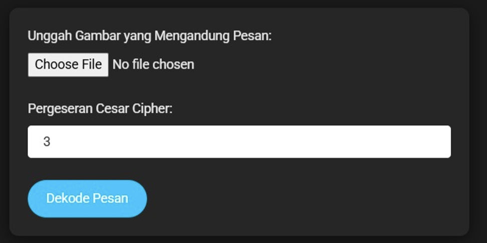
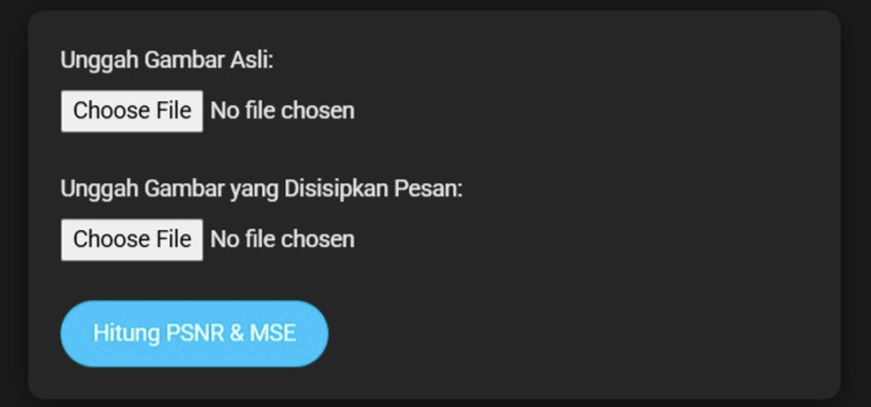

# Steganography Application with Caesar Cipher

This application allows users to insert messages into images using steganography and Caesar Cipher techniques. Users can upload an image, enter the text message they want to insert, and decode the message in the image. In addition, the app also calculates the PSNR (Peak Signal to Noise Ratio) and MSE (Mean Squared Error) between the original image and the image with the message inserted.

## Key Features

- **Upload Image and Message (Encode)**: Upload an image and insert a message to be inserted using steganography and Caesar Cipher techniques.  
***WARNING***  
can only input one word and cannot input sentences or contain spaces and numbers.  
can only input images with **.png** format  

***To use the decode feature, download the image that appears as a result of the encode***
- **Decode Message (Decode)**: Uploads the image with the message inserted and decodes the hidden message in the image.  
  *the cesar cipher shift is used as the key to open the decode set in the encode option. use the same key for the decode to work.*
- **Calculate PSNR & MSE**: Calculates and displays the PSNR and MSE values between the original image and the image with the inserted message.
- **Responsive Display**: Using Bootstrap 4 and minimalist design with dark theme.

## Prerequisites

Before getting started, make sure you have the following:

- **Web browser**: Google Chrome, Mozilla Firefox, or any other modern browser.
- **Server Backend**: This application requires a backend to manage the encryption/decryption process and PSNR/MSE calculation. You can use Python with Flask or any other backend server that supports forms and image processing.
- **Internet Connection**: This app relies on CDN (Content Delivery Network) for Bootstrap and icons from Boxicons.

  <h2>encode display</h2>

  

  

  <h2>decode display</h2>

  

  

  <h2>PSNR and MSE display</h2>

  

